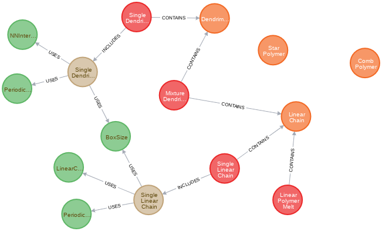

# neo4BFMPolymers

> Access a [neo4j](https://neo4j.com/) database to efficiently organize simulations of polymers, using the [bond fluctuation model (BFM)](https://en.wikipedia.org/wiki/Bond_fluctuation_model) and the [LeMonADE library](https://github.com/LeMonADE-project).

## Python interface for a graph based database

The neo4BFMPolymers tool collection contains several python functions to add polymers, simulation setups, simulation parameters and relations between the various nodes in a neo4j database.
The available node types and connection types are defined in the function definitions, to avoid doubling of nodes with similar meaning.

The available functions can be used as a python module by exporting the jupyter-notebooks to a plain python file or directly in the notebook.

## Getting Started

For a local usage, it is recommended to install the [desktop version of neo4j](https://neo4j.com/download/) and access a plain database.
The python library [py2neo](https://py2neo.org/v4/) is used to access the database (default with username `neo4j` and host `bolt://localhost:7687`) via the [Graph class](https://py2neo.org/v4/database.html#the-graph) of py2neo with the jupyter-notebooks provided in this repository.
Once the connection to the database is working, the available functions allow you to add nodes, connections and data to the database.
You can insert the data manually, or parse bfm files or output files from [LeMonADE](https://github.com/LeMonADE-project) for large amounts of data.

## Documentation

The documentation is done with [DocStrings](https://www.python.org/dev/peps/pep-0257/).
To call a documentation, run `help( class or function )`.

## Dependencies

Naturally, the python tools need a running [neo4j](https://neo4j.com/) database that can be accessed by the [Graph class](https://py2neo.org/v4/database.html#the-graph).

The following python libraries are used:
* [py2neo](https://py2neo.org/v4/)
* [pandas](https://pandas.pydata.org/)
* [datetime](https://docs.python.org/3/library/datetime.html)
* [os](https://docs.python.org/3/library/os.html)
* [sys](https://docs.python.org/3/library/sys.html)
* [socket](https://docs.python.org/3/library/socket.html)
* [inspect](https://docs.python.org/3/library/inspect.html)

## Tests

* the python test framework [pytest](https://docs.pytest.org/en/latest/) is used
* run the tests from the head directory by `pytest tests/`

## Linter

* the python linter [flake8](https://pypi.org/project/flake8/) is used with the call `flake8 --statistics --ignore E501,E402,E221`
* -> the maximum length of the line and imports at the very beginning of the -py files are ignored
* the linter is not included in the CI pipeline, but it is recommended to use it

## Continous integration

* the CI pipeline was set up following a [realpython tutorial](https://realpython.com/python-continuous-integration/) 
